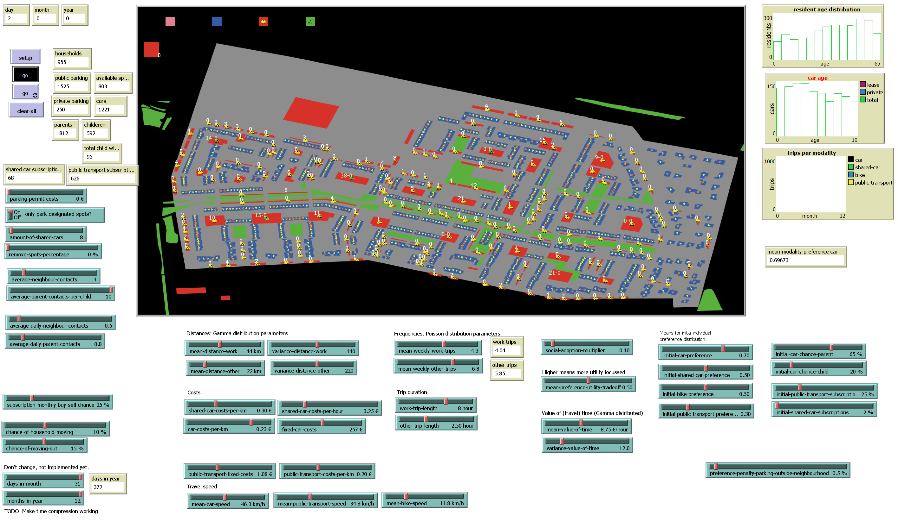

# Agent-based car sharing
A project investigating in cooperation with the RIVM modelling the effects of car sharing and parking policies in Enka, Ede, The Netherlands. This project was part of the SEN9120 Advanced Agent Based Modelling course at the Delft University of Technology.

## Repository structure
The repository is structured as follows:
- [`ABC_model.nlogo`](ABC_model.nlogo) contains the main model, including:
    -	Interface with visualisation, sliders and metrics.
    - High-level functions: setup, go, and go-daily, go-monthly, and go-yearly.
-	[`init.nls`](init.nls) contains setup functions, like:
    -	Spatial: GIS elements, parking spots, station, and virtual locations.
    -	Agents: Residents with their properties and social network.
    -	Objects: Households, cars, and destinations.
-	[`tick.nls`](tick.nls) contains unctions that are called periodically, like:
    -	Daily functions: Making (including deciding modality) trips, ending trips, and moving cars.
    -	Monthly functions: Buy or sell subscriptions and cars, and share/update modality preferences.
    -	Yearly functions: Age residents and move-out households and adult-aged children
- [`GIS_data`](GIS_data) contains the geospatial data that the model read in during the setup, including houses, parking spots and land area use.
-	[`notebooks`](notebooks) contain the Python scrips ([`run_experiments.py`](notebooks/run_experiments.py) and [`run_sensitivity.py`](notebooks/run_sensitivity.py)) and the notebooks ([`process_experiments.ipynb`](notebooks/process_experiments.ipynb), [`process_initialization.ipynb`](notebooks/process_initialization.ipynb) and [`process_sensitivity.ipynb`](notebooks/process_sensitivity.ipynb)) to run and process all the experiment data.
- [`results`](results) contain all the raw results from the experiments, as [Pandas](https://github.com/pandas-dev/pandas) DataFrames saved in [pickles](https://docs.python.org/3/library/pickle.html).
- [`images`](images) contain all the plots and other images generated by the notebooks and used in the report and slide deck.

The full report can be found at [ABC_report.pdf](ABC_report.pdf) and a condensed slide deck presented to the RIVM at [ABC_slide_deck.pdf](ABC_slide_deck.pdf).

## Requirements
 - The model was build in [NetLogo](https://github.com/NetLogo/NetLogo), using version [6.3.0](https://github.com/NetLogo/NetLogo/releases/tag/6.3.0).
 - Experiments were performed with Python 3.11 using a [modified version](https://github.com/quaquel/pyNetLogo/pull/61) of [pyNetLogo](https://github.com/quaquel/pyNetLogo) to work with NetLogo 6.3.0. Pandas [1.5.3](https://github.com/pandas-dev/pandas/releases/tag/v1.5.3) was used to transform data and save in a pickle.
 - Analyzing the data was done mostly in Pandas and [Seaborn](https://github.com/mwaskom/seaborn) [1.12.2](https://github.com/mwaskom/seaborn/releases/tag/v0.12.2) and [Matplotlib](https://github.com/matplotlib/matplotlib) [3.7.0](https://github.com/matplotlib/matplotlib/releases/tag/v3.7.0) were used to create the plots.

## License

The model and all code is available under the GNU General Public License v3.0 license. Feel free to contact us when you want to use it in a way not compatible with this license.
